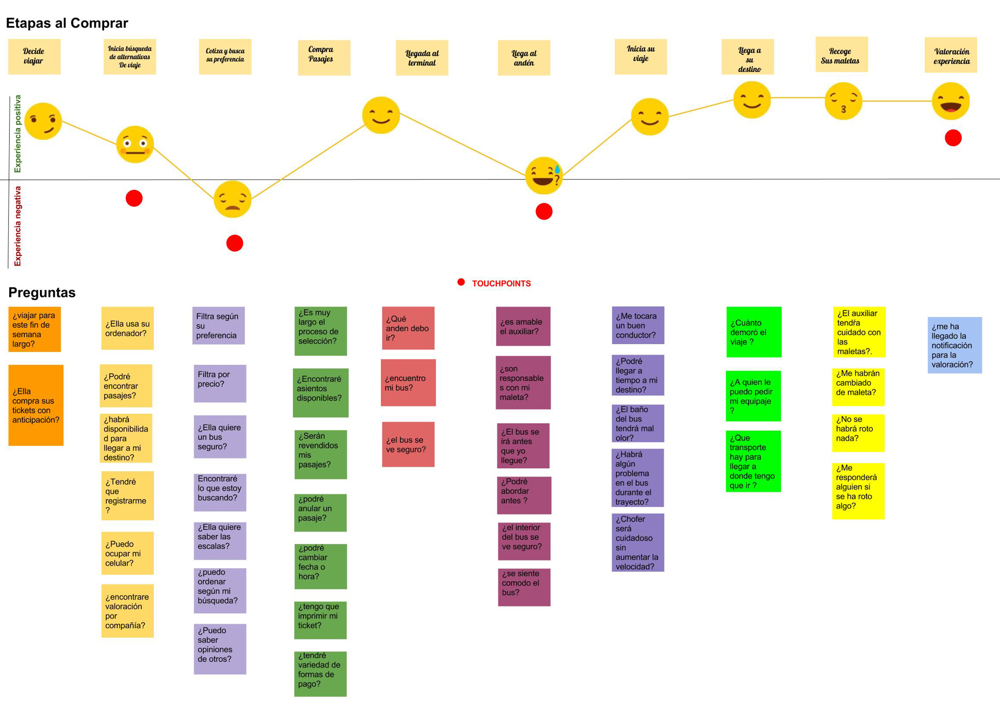

# Safetravel
El proyecto que se presentó fue indagar en una nueva experiencia para viajar en bus, por lo cual trabajé en la parte de investigación y prototipado del MVP (Mínimo producto viable)

## Proceso de diseño

## Descubrimiento e Investigación

### User Research:
#### Entrevistas
Tras realizar una serie de entrevistas en Terminal San Borja y Terminal Sur, pudimos dar con un patrón que se repetía en la serie de entrevistados: la falta de seguridad durante el viaje, la poca confianza en el servicio de buses y la incertidumbre de contar con un viaje cómodo. Además dentro de lo que se observó en ambos terminales, los pasajeros por lo general estaban nerviosos, ansiosos y preocupados, la falta de información respecto al total de la experiencia de viajar en bus era aquello que los afectaba como usuarios.

## Sintesis y Definición
### Problem Statement
Definición del problema:

* {Alejandra} Necesita encontrar la información constante del viaje en el bus para sentirse más segura, cómoda y comunicárselo a sus seres queridos.

### HMW (¿Cómo podríamos?)

* ¿Como podriamos ayudar a nuestros usuarios a que obtengan más información sobre seguridad y confort en la experiencia de viajar?

### What if? (¿Y si?)

* ¿Y si pudiéramos conocer la valoración/puntuación de otros usuarios?
* ¿Y si los usuarios tienen la opción de ser más específicos en su búsqueda?
* ¿Y si los usuarios obtienen notificaciones durante el viaje para compartirlo?
* ¿Y si se puede ver la ubicación de nuestro bus?

### User Persona

### Diagrama de afinidad

## Ideación

Luego de la investigación se desarrolló un user Persona para tener mayor claridad respecto a como abordábamos la problemática. Se creó a "Alejandra", joven universitaria que se sentía muy insegura a la hora de viajar en bus, ella necesitaba encontrar la información constante del viaje en el bus para sentirse más segura, cómoda y comunicárselo a sus seres queridos. Alejandra representaba a todos aquellas personas que pueden ser menores de edad, adulto mayor o contar con una discapacidad, y que necesitan comunicar y transmitir seguridad al otro que espera por su llegada.

### Customer Journey Map

## Prototipado

Se Puede ver el prototipo de la aplicación [aqui](https://marvelapp.com/136jga16).

